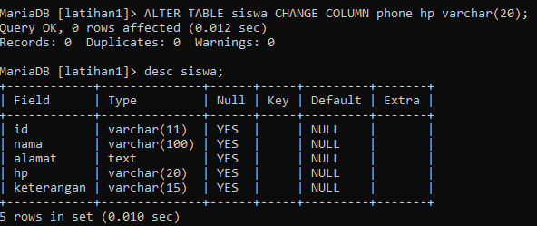
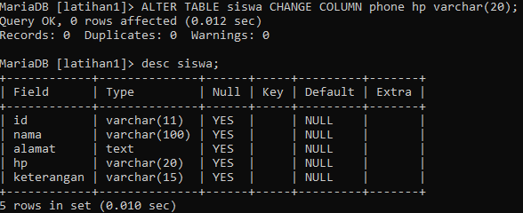

# PRAKTIKUM 1

# - Pertama tama kita membuat database latihan 1 seperti gambar di bawah ini

# - Melihat basis data yang ada di my sql

# - kemudian membuat tabel dengan menggunakan perintah di bawah ini nama dan alamat 

CREATE TABLE siswa (nama VARCHAR(100),alamat TEXT);

# - Menambahkan kolom keterangan dengan menggunakan perintah seperti di bawah ini beserta contoh nya 

ALTER TABLE siswa ADD COLUMN keterangan VARCHAR(15) AFTER alamat;

# - Kemudian kita akan mengubah nama kolom id(int 11) dengan menggunakan perintah dan contoh nya seperti di bawah ini

ALTER TABLE siswa ADD COLUMN id int(11) First;

# - Tambahkan sebuah kolom untuk id (varchar11)

ALTER TABLE siswa MODIFY COLUMN id varchar(11) after alamat;

# - Ubah tipe data kolom hp menjadi char(20)

ALTER TABLE siswa MODIFY COLUMN phone hp VARCHAR(20);

# - Mengubah nama kolom phone menjadi hp (varchar20)

ALTER TABLE siswa CHANGE COLUMN phone hp varchar(20);

# - Menambahkan kolom email setelah kolom hp

ALTER TABLE siswa ADD COLUMN email text after hp;

# - Hapus kolom keterangan dari tabel

ALTER TABLE siswa DROP keterangan;

# - Ganti nama tabel menjadi data_mahasiswa

ALTER TABLE siswa RENAME data_mahasiswa;

# - Mengubah kolom nim (11)

ALTER TABLE data_mahasiswa CHANGE COLUMN id nim varchar(11);

# - Menambahkan primary key dengan menggunakan perintah di bawah ini

ALTER TABLE siswa ADD PRIMARY KEY(nim);

# - Menambahkan constraint dengan menggunakan perintah di bawah ini

ALTER TABLE siswa ADD CONSTRAINT PK_siswa PRIMARY KEY(email);

- Pengertian dari int(11)
int (11) nunjukkan bahwa kolom memiliki tipe data bilangan bulat (integer) dengan ukuran 11 digit 

- Melihat struktur tabel dengan perintah desc dan ada kolom null berisi yes dan no apa itu?
Jika kolom "Null" adalah "YES", itu berarti kolom tersebut diizinkan untuk memiliki nilai NULL.

Jika kolom "Null" adalah "NO", maka kolom tersebut tidak diizinkan untuk memiliki nilai NULL

